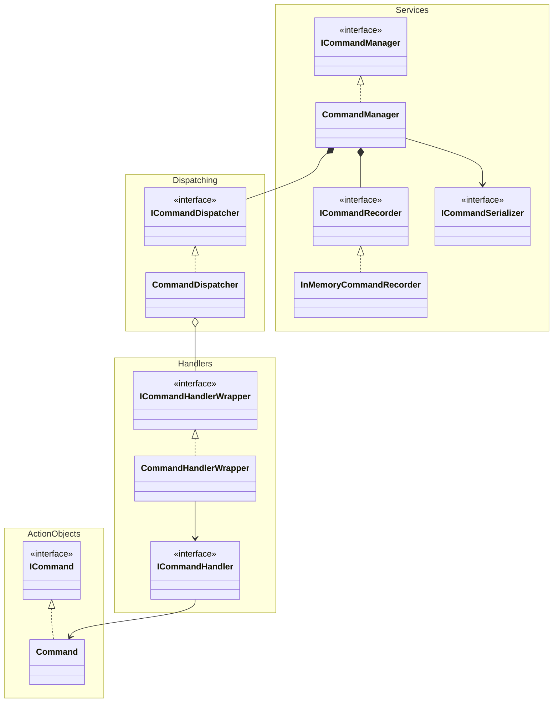

# Command Pattern

The Command Pattern is a behavioral design pattern that encapsulates a request as an object, allowing you to parameterize objects with different requests, delay or queue a request's execution, and support undoable operations. This package provides a flexible implementation of the Command Pattern for Unity projects, enabling developers to manage commands, handlers, and dispatchers effectively.

### Key Components
- **ActionObjects**: Defines the core command structure, including the `ICommand` interface and its implementation.
- **Handlers**: Contains interfaces and classes for handling commands, such as `ICommandHandler` and `CommandHandlerWrapper`.
- **Dispatching**: Manages the dispatching of commands through the `ICommandDispatcher` interface and its implementation.
- **Services**: Provides additional services like command management, recording, and serialization through interfaces such as `ICommandManager`, `ICommandRecorder`, and `ICommandSerializer`.

This package is designed to promote clean architecture and separation of concerns, making it easier to extend and maintain your Unity project.
Additionally, this package supports undoable operations, allowing developers to revert commands and restore previous states seamlessly. This feature is particularly useful for implementing functionalities like undo/redo systems in your Unity project, enhancing user experience and flexibility.

